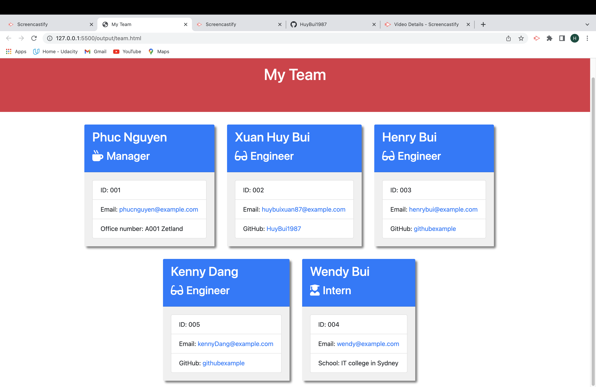

# Homework-Week-10: OOP Team Profile Generator
## Description

This asssignment is about Object Oriented Programming and unit testing. The objective for this project was to build a Node.js command-line application that takes in information about employees on a software engineering team, and with that information generates an HTML webpage that displays the user input data. One requirement of the application was to make use of Constructors and Classes to create the employee objects. There were the Employee, Manager, Engineer, and Intern classes. on the other hand, we need to use jest and inquirer to test every single part of the app to make sure that it runs correctly without any issues.

## Table of Contents

- [User Story](#user-story)
- [Acceptance Criteria](#acceptance-criteria)
- [Screenshot](#screenshot)
- [Walkthrough Video](#walkthrough-video)
- [Credits](#credits)

# User Story

```md
AS A manager
I WANT to generate a webpage that displays my team's basic info
SO THAT I have quick access to their emails and GitHub profiles
```

## Acceptance Criteria

```md
GIVEN a command-line application that accepts user input
WHEN I am prompted for my team members and their information
THEN an HTML file is generated that displays a nicely formatted team roster based on user input
WHEN I click on an email address in the HTML
THEN my default email program opens and populates the TO field of the email with the address
WHEN I click on the GitHub username
THEN that GitHub profile opens in a new tab
WHEN I start the application
THEN I am prompted to enter the team manager’s name, employee ID, email address, and office number
WHEN I enter the team manager’s name, employee ID, email address, and office number
THEN I am presented with a menu with the option to add an engineer or an intern or to finish building my team
WHEN I select the engineer option
THEN I am prompted to enter the engineer’s name, ID, email, and GitHub username, and I am taken back to the menu
WHEN I select the intern option
THEN I am prompted to enter the intern’s name, ID, email, and school, and I am taken back to the menu
WHEN I decide to finish building my team
THEN I exit the application, and the HTML is generated
```

## Screenshot
This is a screenshot of the generated HTML webpage.



## Walkthrough Video
[Link to Google](https://drive.google.com/file/d/1lbDvg_D_3kqpfoI_SC31_UnLj2FVyhwt/view)

## Credits
- Bootstrap: https://getbootstrap.com/
- NodeJS: https://nodejs.org/en/
- Jest: https://www.npmjs.com/package/jest
- Inquirer: https://www.npmjs.com/package/inquirer


    
